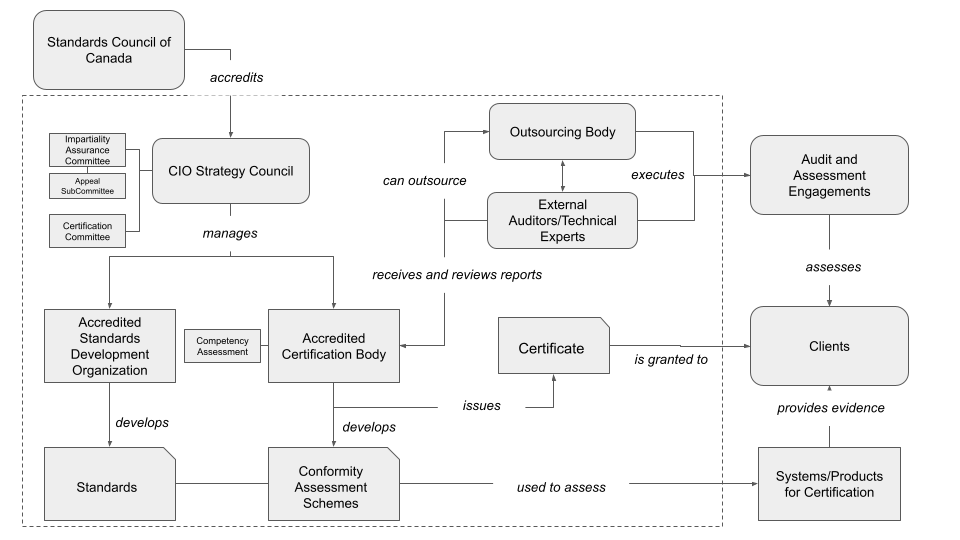
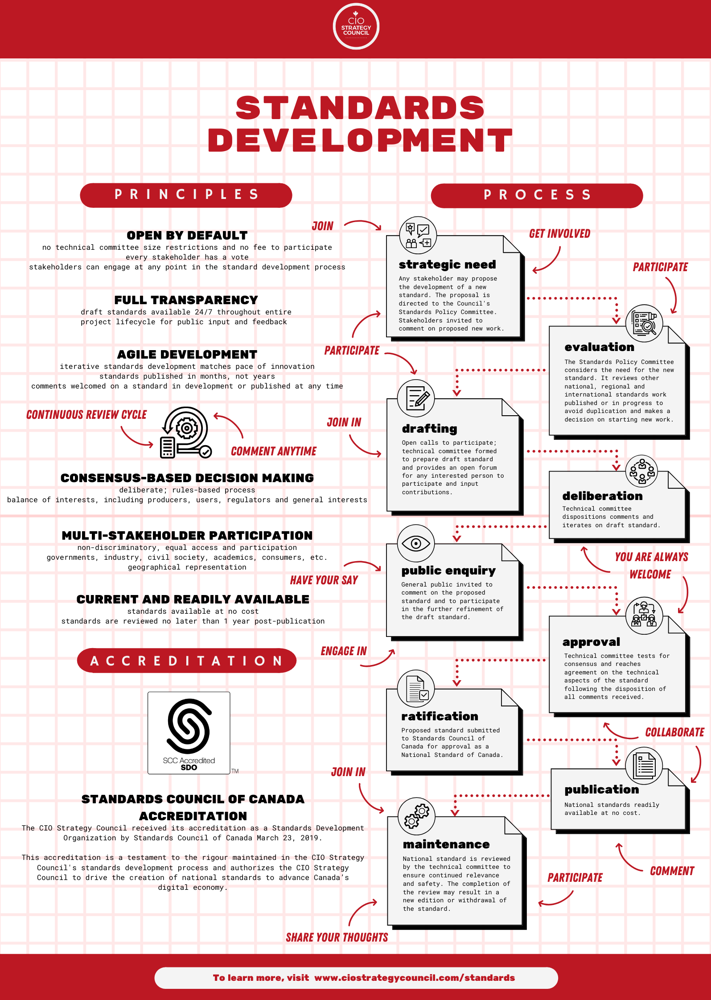
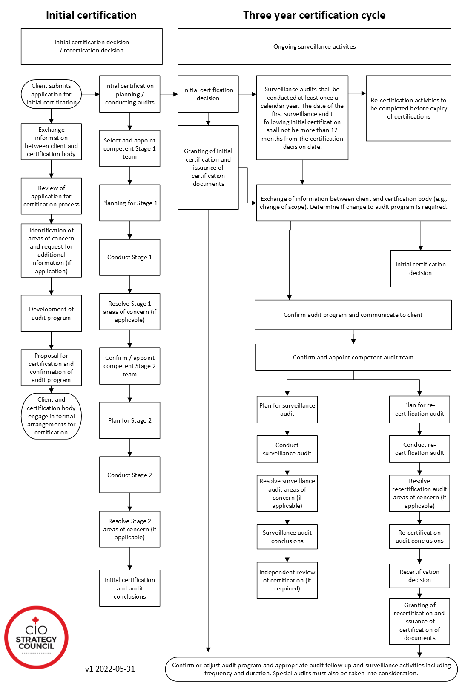
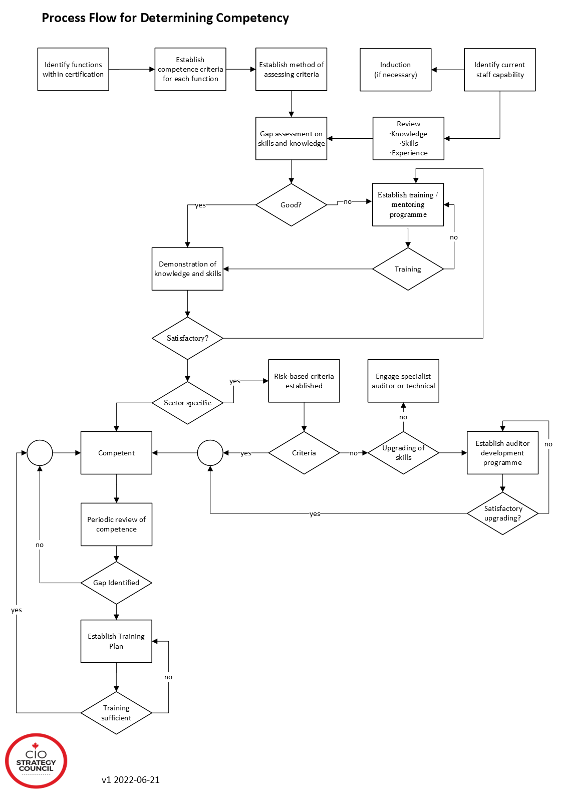
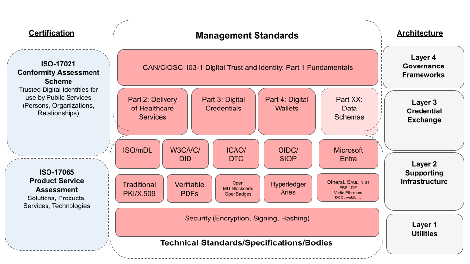

# Standards and Certification Primer
This document is intended to provide background information for those unfamilar with the standards development and certification process. 
## Accreditation Process
It all begins with the **accreditation process**. There are two types of accreditation: **standards development** for national standards and **certification body** for conformity assessment and certification. In Canada, this is overseen by [Standards Council of Canada](https://scc/ca).  CIOSC is currently an [Accredited Standards Development Organization](https://www.scc.ca/en/news-events/news/2019/cio-strategy-council-earns-accreditation-develop-national-standards-canada) and is currently underway to become  an [Accredited Certification Body](https://www.scc.ca/en/accreditation/find-accredited-or-certified-body).

The diagram below shows how the major pieces fit together conceptually.

## Standards Development Process
In accordance with SCC requirements, CIOSC has defined a standards development process principles that are **open by default** with **full transparency** using **agile development**. To ensure standards are developed to serve a broad array of stakeholders, principles embracing **consensus-based decision-making**, **multi-stakeholder participation**, and **current and readily avaialable** are also defined.

The infographic below illustrates how everything works together for standards development.

## Certification Process

## Determining Competency

## Standards and Architecture Landscape

