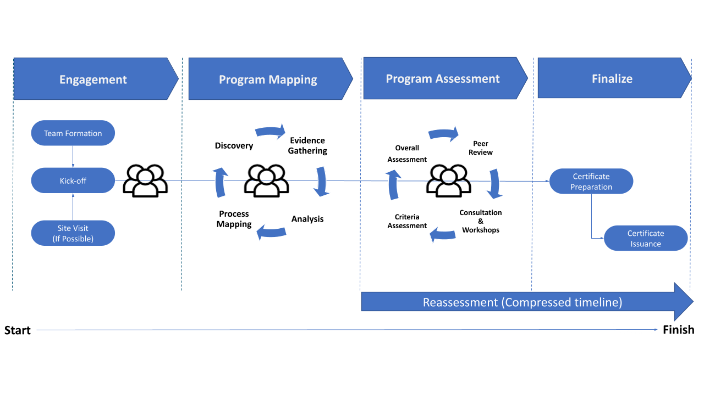
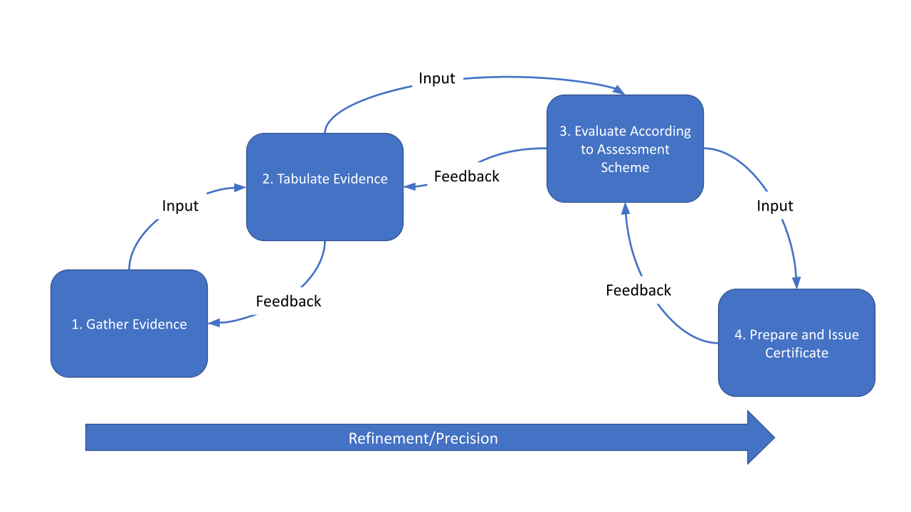

# Introduction to Audit Methods
An audit can be performed using a range of audit methods. An explanation of commonly used audit methods can be found in this documennt. The audit methods chosen for an audit depend on the defined audit objectives, scope and criteria, as well as duration and location. Available auditor competence and any uncertainty arising from the application of audit methods should also be considered. Applying a variety and combination of different audit methods can optimize the efficiency and effectiveness of the audit process and its outcome.

Performance of an audit involves being audited and the technology used to conduct the audit. Examples of audit methods that can be used, singly or in combination, in order to achieve the audit objectives. If an audit involves the use of an audit team with multiple members, both on-site and remote methods may be used simultaneously.

# Background and Context
The audit methods developed for this conformity assessment scheme combine established practices and experience gained through past engagements of applying the [Public Sector Profile of the Pan-Canadian Trust Framework](https://github.com/canada-ca/PCTF-CCP/tree/master/Version1_4). Both the standard and this conformity assessment scheme have benefited from lessons-learned through the application of the trust framework. 

Following is a description of the methods used.

## Detailed Assessment Methods
The figure below illustrates the detailed audit process occuring over four major phases.

* **Engagement** phase involving team formation, project kick-off and site visit (if possible)
* **Program Mapping** phase involving discovery, evidence gathering, analysis and process mapping.
* **Program Assessment** phase involving consultation & workshopds, criteria assessment, overall assessment and peer review
* **Finalize** phase involving certificate preparation and issuance.

## Iterative Assessment Methods
The figure below illustrated an iterative assessment process that can be conducted through the audit process.
* **Gather Evidence** gathering of evidence required for the assesment process.
* **Tabulate Evidence** organizing of evidence; this may result in discovering gaps, inconsistencies which can be fed back into the gathering evidence process.
* **Evaluate According to Assessment Scheme** evaluating the evidence according to the assessment scheme; this may result in additional evidence being required which can be fed back in the tabulate evidence process.
* **Prepare and Issue Certificate** based on the outcomes of the assessment,

## Other Audit Methods
Depending on the context and nature of the engagement, other audit methods may be employed and are described below.

### Human Interaction
#### On-site
* Conducting interviews
* Completing checklists and questionnaires with client participation
* Conducting document review with client participation
#### Remote
* Via interactive communication means
* Conducting interviews
* Observing work performed with remote guide

### No Human Interaction
#### On-site
* Conducting document review (e.g., records, data analysis)
* Observing work performed
* Conducting an on-site visit
* Completing checklists
* Sampling
#### Remote
* Conducting document review
* Observing work performed
* Analysing data

### Open Source Intelligence (OSINT)
Collection and analysis of non-sensitive data gathered from open sources. Sources include:
* Publicly avaiable information
* Sales, marketing information
* Public goverment data
* Professional and academic information
* Social media
