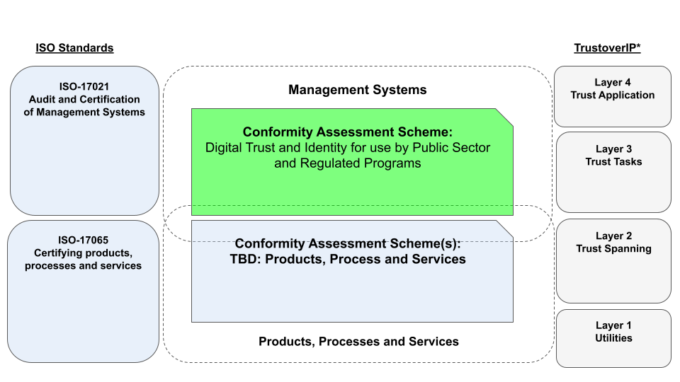

# Validation of Need for a Digital Trust and Identity Conformity Assessment Scheme

## Market Need

There is an emerging market need for the certification of digital trust and identity programs for public sector, private sector and Regulated Programs). The market need is beyond whether the technology actually works, but rather that user has confidence in the technology *and* the overall integrity of a program delivering the digital trust service. 

While **digital identity** is the initial focus of this scheme, there is an opportuntiy to expand the scope more broadly to **digital trust** encompassing other areas digital credentials, data governance and responsible AI.
In the end, a digital trust and identity program requires more than a sound technical implementation, it requires: 
* accepted principles;
* good governance; 
* a specific mandate or purpose;
* sound management; 
* a legal operating context; and most importantly,
* user confidence and social acceptance.

## Strategic Fit
The diagram below illustrates the [strategic fit](https://www.bstrategyinsights.com/strategic-fit/) of the conformity assessment scheme (in green) in relation to [ISO 17021-1:2015](https://www.iso.org/standard/61651.html), [ISO/IEC17065:2012](https://www.iso.org/standard/46568.html) and the [Trust Over IP Model](https://trustoverip.org/toip-model/). 

Put simply, the Digital Trust and Identity conformity assessment scheme, in accordance with ISO 17021, ensures the confidence the of management system underpinning a digital trust service that provides identity, while complementary schemes, in accordance with, ISO 17065, ensure the confidence of products, processes and services. As depicted in the diagram, there can be overlap of scope beween the schemes, for example a service that is certified specifically under 17065, may be part of a larger program that is certified under 17021. 

It is anticipated that a [competent authority](https://en.wikipedia.org/wiki/Competent_authority) would seek certification under 17021, while vendors of products, processs and services vendors would seek certification under 17065. The schemes (as indicated in the diagram) are complementary to one another, and in certain cases, may overlap in scope.

# Description and Purpose of Scheme

Decribed in [README.md](../README.md)

# Description of Requirements

* The scheme requirements are based on the draft of [CAN/CIOSC 103-1 Second Edition](../docs/DRAFT-CAN-CIOSC-103-1-20XX_D1_EN.pdf) which is currently under public review
* Conformance requirements are tabulated and cross-refrenced to the standard in the [worksheet](./tools/Conformity-Assessment-Workbook.xlsx)

# Analyis of Scheme Requirements

* Scheme requirments are based on the Public Sector Profile of the Pan-Canadian Trust Framework [Consolidated Overview Version 1.4](https://github.com/canada-ca/PCTF-CCP/blob/master/Version1_4/PSP-PCTF-V-1.4-Consolidated-Overview-EN-2021-12-16.pdf)

# Methods to be used for determining fulfilment of the requirements

# Appropriateness of Methods

# Decision on the conformity assessment activity

# Appropriateness of Co

## References
* [Public Sector Assurance](https://publicsectorassurance.org/)
* [#GoodID](https://cyber.harvard.edu/story/2021-11/incorporating-good-id)

## Media Articles
* techcabal: [The Next Wave: We are sleepwalking into a biometric dystopia](https://techcabal.com/2022/08/15/africas-biometric-dsytopia/)
* Human Rights Watch: [New Evidence that Biometric Data Systems Imperil Afghans](https://www.hrw.org/news/2022/03/30/new-evidence-biometric-data-systems-imperil-afghans)