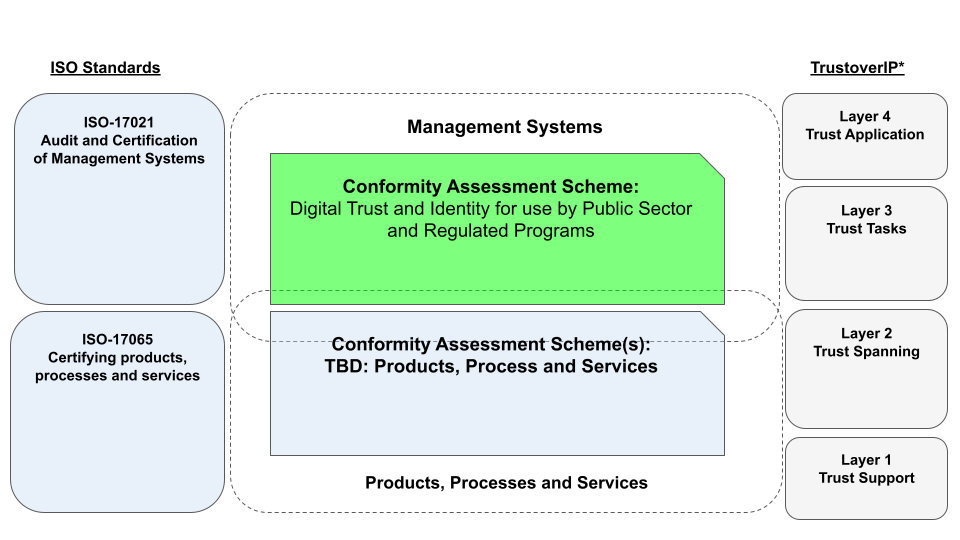

# Validation of Need for a Digital Trust and Identity Conformity Assessment Scheme

# Market Need

There is an emerging market need for the certification of digital trust and identity programs for the public sector and the private sector. These programs may draw their enabling mandates from legislation, regulation, or industry best practices. The market need is to ensure that these programs are trustworthy based on a standardized assessment approach that is technology-agnostic and which can evaluated indedependently  considering the varied contextual factors of legislation, requlation, industry practices, etc.

The emphasis of the conformity assessment scheme is on the overall soundness of the program, such that its stakelolders have confidence in the delivery of digital trust and identity services. Technology plays an important part, but technology, their functions need to be situated within a digital trust and identity program context that is producing the right outputs and achieving the right outcomes.

While **digital identity** is the initial focus of this scheme, there is an opportuntiy to expand the scope more broadly to **digital trust** encompassing other areas digital credentials, data governance and responsible AI.
In the end, a digital trust and identity program requires more than a sound technical implementation, it requires: 
* accepted principles;
* good governance; 
* a specific mandate or purpose;
* sound management; 
* a legal operating context; and most importantly,
* user confidence and social acceptance.

# Strategic Fit
The diagram below illustrates the [strategic fit](https://www.bstrategyinsights.com/strategic-fit/) of the conformity assessment scheme (in green) in relation to [ISO 17021-1:2015](https://www.iso.org/standard/61651.html), [ISO/IEC17065:2012](https://www.iso.org/standard/46568.html) and the [Trust Over IP Model](https://trustoverip.org/toip-model/). 

Put simply, the **Digital Trust and Identity Conformity Assessment Scheme**, in accordance with **ISO 17021**, ensures confidence the management system underpinning a digital trust service that provides identity. In turn, conformity assessment schemes for products,processes and services, in accordance with, **ISO 17065**, ensure the confidence of products, processes and services. As depicted in the diagram, there can be overlap of scope beween these schemes, which can be complementary. For example a service that is certified specifically under ISO 17065, may also be part of a larger program that is certified under ISO 17021. 

It is anticipated that market will consist of [competent authorities](https://en.wikipedia.org/wiki/Competent_authority) seeking certification of their programs under 17021. Examples could include:

* **Government digital identity programs** to provide an independent assurance to policymakers, regulators that the program is indeed doing what it is actually intended to do.

* **Industry bodies** seeking mututal recognition across different sectors that work together. The conformity assessment scheme and the resulting certifications provide the independed audit and baseline of confidence required by all industry sectors..

 Vendors of products, processs and services vendors would seek certification under 17065. The schemes (as indicated in the diagram) are complementary to one another, and in certain cases, may overlap in scope. Examples include:

 * **Certification of Products** such as hardware devices that are used for secure authentication or facilitate the collection of sensitve personal data such as biometric templates.

 * **Certification of Processes and Services** such as real-time document checking, digital credential issuance, and liveness testing.

 The [Trust Over IP model](https://trustoverip.org/toip-model/) helps map the exsting standards and conformity assessment schemes into a set of abstracted layers. This model helps to better understand the separation of concerns within an emerging global digital ecosystem. The layers are defined as:
 * **Layer 4 Trust Applications** - representing the application ecosystem
 * **Layer 3 Trust Tasks** - representing functions that enable the yield or tranfer of value, such as credential issuance and credential presentation.
 * **Layer 2 Trust Spanning** - representing the peer-to-peer protocols that enable systems to interact across the boundaries of enterprises, networks and geopolitical entities.
 * **Layer 1 Trust Support** - representing utility functions and frameworks such as decentralized identifiers, distributed ledgers and decentralized file systems.

Looking at the diagram - 17021 management systems conformity assessment schemes map to Layers 3 and 4 while 17065 products/products/services conformity assessment schemes map to Layers 1 and 2.

# Description and Purpose of Scheme

The purpose of this scheme to provide conformity assessments for 

* **Public Sector Programs** which are any public programs or services using a trusted digital identity that is directly provided by a federal, provincial, territorial or municipal government. The services may include, but are not limited to: government sign-in services, online benefits delivery, or licensing and permits. Examples of trusted digital identity services used in this context are the [BC Services Card](https://www2.gov.bc.ca/gov/content/governments/government-id/bc-services-card) and [MyAlberta DigitalID](https://account.alberta.ca/) programs.
* **Regulated Progams** which are any private sector or not-for-profit programs or services using a trusted digital identity that is subject to regulatory requirements such as **Know Your Client (KYC)**, or **Anti-Money Laundering (AML)**. These services include the broader public sector, not-for-profit organizations, and for-profit organizations subject to regulatory requiremens. Examples include, but are not limited to: educational institutions, open banking, insurance, health care, hospitals, or any commercially-available service. Examples of trusted digital services used in this context are the [Canada Post IdentityComplete](https://www.canadapost-postescanada.ca/cpc/en/business/postal-services/digital-proof-identity.page) program.
* the scheme can also be used for **Trusted Programs** which are any programs that may not be specifically subject to a legislative or regulatory mandate, but rather employ industry best practices and is viable in the marketplace due to its stature, reputation and ability to meet the needs of their users.

For more detail, please go to [README.md](../README.md)

# Description of Requirements

* The scheme requirements are based on the draft of [CAN/CIOSC 103-1 Second Edition](../docs/DRAFT-CAN-CIOSC-103-1-20XX_D1_EN.pdf) which is currently under public review
* Conformance requirements are tabulated and cross-refrenced to the standard in the [worksheet](./tools/Conformity-Assessment-Workbook.xlsx)

# Analyis of Scheme Requirements

* Scheme requirments are based on the Public Sector Profile of the Pan-Canadian Trust Framework [Consolidated Overview Version 1.4](https://github.com/canada-ca/PCTF-CCP/blob/master/Version1_4/PSP-PCTF-V-1.4-Consolidated-Overview-EN-2021-12-16.pdf)

# Methods to be used for determining fulfilment of the requirements

Audit methodology is described in detail here [Audit Methods](./audit-methods.md)

# Appropriateness of Methods

# Decision on the conformity assessment activity

## References
* [Public Sector Assurance](https://publicsectorassurance.org/)
* [#GoodID](https://cyber.harvard.edu/story/2021-11/incorporating-good-id)

## Media Articles
* techcabal: [The Next Wave: We are sleepwalking into a biometric dystopia](https://techcabal.com/2022/08/15/africas-biometric-dsytopia/)
* Human Rights Watch: [New Evidence that Biometric Data Systems Imperil Afghans](https://www.hrw.org/news/2022/03/30/new-evidence-biometric-data-systems-imperil-afghans)